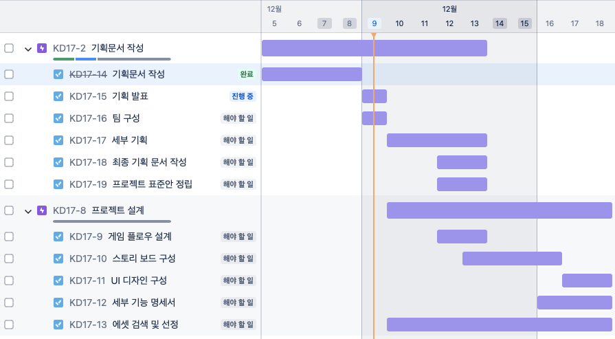

# KD17_Project

## 기획 발표문서

### 기획 문서 내용

- 프로젝트 명 (가칭)
- 콘텐츠 장르 (게임/교육/기타)
- 기획 의도
- 레퍼런스 게임 여부 
- VR/AR 플랫폼을 선정한 이유
- 플레이 타임 고려
- 명확한 소비 대상층 선정
- 게임(싱글/멀티 플레이)
- 어트랙션 사용여부 (Sym4D)

### 기획 발표

- 기획 발표일자 : 2024/12/10 09:00 ~ 11:00
- [발표 문서 업로드](https://drive.google.com/drive/folders/17SMgadIfGi9saQiG_Uh-RY2pVW9wLfKu?usp=share_link)

## 최종 기획서 작성

- 팀구성 후 최종 기획서 작성
- 변경사항 반영
- [최종 기획서 업로드](https://drive.google.com/drive/folders/17SMgadIfGi9saQiG_Uh-RY2pVW9wLfKu?usp=share_link)

## 기획 팀 빌딩

- 3인 1팀 기본 (예외적으로 2인, 4인 팀도 가능)
- 팀별 자리 배치
- 선정된 기획에 대해 팀원간 아이디어 회의
- 대략적인 구현 기능 목록 정리

## 최종 프로젝트 팀

|  NO   | 팀명 | 프로젝트명 | 플랫폼 | 팀장 | 팀원 | 트렐로 |
| :---: | ---- | ---------- | ------ | ---- | ---- | ------ |
|   1   |      |            |        |      |      |        |
|   2   |      |            |        |      |      |        |
|   3   |      |            |        |      |      |        |

### 설계 일정



---

### 프로젝트 일정

| 일정              | 기간 |
| :---------------- | :--- |
| **개발 기간**     |      |
| **중간 점검**     |      |
| **발표 문서작성** |      |
| **발표 문서리뷰** |      |
| **알파 테스트**   |      |
| **베타 테스트**   |      |
| **발표 리허설**   |      |
| **시연 및 발표**  |      |

- 프로젝트의 목적
  - 교육기간동안 습득한 VR,AR 기술을 종합적으로 사용한 최종 프로젝트로서 전반적인 개발 과정을 이해하고 다양한 시행착오를 통해 개개인의 개발 역량을 강화한다.
  - 협업을 통해 각각의 역할을 이해하고 개발자간의 연계 작업에 대한 능력을 향상 시킨다.

- 구현 주제

  - 콘텐츠의 내용 및 주제는 제한이 없으며 VR,AR 관련된 콘텐츠를 개발한다.
  - 구현 형태는 체험 또는 게임의 형태이여도 관계없음.
  - 개발할 콘텐츠의 주제 선정시 대상 연령층을 명확히 한다. (예: 성인, 청소년, 아동, ...)
  - 구현 디바이스(Vive, Quest)의 한계를 명확히 인지하고 콘텐츠의 리소스 및 전체적인 분위기(테마)를 선정한다.

- 팀 구성 및 팀장의 역할
  - 기본 3인 1팀으로 구성한다. (특별한 경우 4인 1팀까지도 허용)
  - 팀장은 반드시 팀원들의 동의를 거쳐 선정한다.
  - 팀장과 팀원은 수직적인 관계가 아니며 수평적인 관계임을 명심한다.
  - 팀장은 프로젝트의 전체 일정과 팀원의 업무 분담등 전체적인 프로젝트 관리의 책임을 진다.
  - 팀장은 수시로 프로젝트의 진행상황에 대해 지도강사와 소통한다.
  - 팀장은 팀원의 작업물에 대한 정기적인 통합(Merge)와 프로젝트 전체 백업을 진행한다.(최소 주 1회 이상)
  - 하원시 커밋 & 푸시, 등원시 풀(pull)한 후 작업 진행을 원칙
  - 팀원은 로컬HDD에 개별 백업을 매일 진행한다.(선택사항)

- 협업 및 형상관리
  - 일정관리는 **Trello** 또는 **Notion** 또는 **Jira**을 활용하며 모니터링을 위해 지도 강사(myleje@gmail.com)를 초대한다. [(트렐로 trello.com)](https://trello.com) 
  - 협업 메신저을 사용할 경우 슬렉([Slack](https://slack.com/intl/en-kr/))로 팀 내부적으로 사용하는 것도 권장.
  - 형상관리는 깃허브(Github)를 사용한다.
  - GitHub GUI 툴은 **[SourceTree](https://www.sourcetreeapp.com)**, [GitHub Desktop](https://desktop.github.com),   [GitKraken](https://www.gitkraken.com) 중 하나를 선택한다. (SourceTree 권장함.)
  - SourceTree는 팀원간의 깃 사용이 능숙해지는 중간 평가후 사용한다.(선택사항) 그전까지는 CLI(Command Line Interface)에서 명령어를 통해 작업한다.
  - 깃허브 사용시 개발자별 브랜치를 생성한다. 개발자 브랜치의 네이밍을 다음과 같이 **dev/영문이니셜** 방식을 추천.
    ```
    dev/LJH
    dev/PJW
    ```
  - 개발 브랜치(develop)를 운영할 것인지를 결정
  - 팀장은 매일 팀원들의 소스 코드의 수동 백업 여부를 확인 및 관리한다.

- 구현 기기
  - HMD 장비 : Oculus Quest
  - 어트렉션  : Sym4D (선택사항)
  - 네트워크 기능 (선택사항)

### 팀 미팅

- 깃허브 리포지토리 Owner 선정
- 깃허브 리포지토리 생성
- 팀원 업무 분장 (대략적인 업무)
- 프로젝트 세부 기획 (브레인 스토밍 - 트렐로, 노션, Jira 등에서 작성)

### 프로젝트 표준안 정립

- 프로젝트 뷰의 폴더명 규약
- 함수(메소드) 명명 규칙 (Pascal Case)
- 변수 명명 규칙 (Camel Case)
- 로컬 백업 방식 및 주기 결정
- [유니티 C# 표준안](https://github.com/IndieGameMaker/CharpCodingStandard)

### 프로젝트 설계문서

1. 게임 플로우 (Lucidchart)
2. Screen Design (ppt)
3. UI Design (ppt)
4. 기능 명세서 (excel)

---

## 미니 프로젝트 팀 구성

|  프로젝트명   |   팀명   |  팀장  |          팀원          |   픒랫폼   |                                                     트렐로                                                     |
| :-----------: | :------: | :----: | :--------------------: | :--------: | :------------------------------------------------------------------------------------------------------------: |
|   UnRailed    |   미정   | 차명근 | 차명근, 김탁영, 양석원 | VR, Photon | [트렐로](https://trello.com/b/5fGuIDl0/mini-projectunrailed-vr?search_id=bcff72fe-7af4-4895-b43c-0a867e8ba7ae) |
| 디펜스 RPG 활 |   미정   | 심성보 |     심성보, 배효은     |     VR     |                            [트렐로](https://trello.com/b/7kuEACU7/my-trello-board)                             |
|    무인도     | 표류자들 | 윤세원 | 윤세원, 송정현, 최성룡 | VR, Photon |                            [트랠로](https://trello.com/b/7kuEACU7/my-trello-board)                             |

### 개발 세부 일정

| 기간                |         구분         |                                                                                                                                  작업                                                                                                                                  |
| :------------------ | :------------------: | :--------------------------------------------------------------------------------------------------------------------------------------------------------------------------------------------------------------------------------------------------------------------: |
| 11월15일            | 기획 발표 및 팀 구성 |                                                                                                            팀장 선임, 트랠로, 슬랙, 깃허브 설정, 세부 기획                                                                                                             |
| 11월18일 ~ 11월22일 |    1차 개발 기간     |                                                                                                                             메인 로직 구현                                                                                                                             |
| 11월25일 ~ 11월28일 |    2차 개발 기간     |                                                                                                                         디버깅, 수정/보안 작업                                                                                                                         |
| 11월28일            |    발표문서 작성     | [문서 탬플릿](https://docs.google.com/presentation/d/1HYUKU_M5ALghtoDSjGQGM6ADzBeRadT5/edit?usp=share_link&ouid=109306707304462513227&rtpof=true&sd=true) / [발표문서 업로드](https://drive.google.com/drive/folders/1nRfjDXFVBbMV6asKpaN3FA-3I1b52YZM?usp=share_link) |
| 11월29일            |     시연 및 발표     |                                                                                                                                                                                                                                                                        |


## 미니 프로젝트

- 기획 발표: 2024.11.15 ([기획문서 업로드](https://drive.google.com/drive/folders/1r4X86MJrmzo3YP9tDqsx6CPOKeBEw2Vg?usp=share_link))
- 팀 인원 : 2인 1팀 또는 3인 1팀
- 개발 기간: 2024.11.18 ~ 2024.11.28

### 주제

- 포톤을 응용한 네트워크 게임
- VR 콘텐츠 (어트랙션 연동)

### 개발 에셋

- 메디치 구매한 유료 에셋 활용
- 타이틀 화면부터 종료 화면 반드시 구현

### 협업 및 코드 백업

- 최종 프로젝트 전 Git / GitHub의 능숙한 사용
- Git / GitHub 활용
- 브랜치 전략 사용

### 미니 프로젝트 시연 및 발표

- 발표문서 작성 : 2024.11.28
- 시연 및 발표 : 2024.11.29

---

## 유니티 프로젝트 생성 절차

### 팀장이 해야할 프로젝트 및 Git 초기 설정

1. Github에서 리포지토리 생성
     - README.md 생성은 선택 사항
     - .gitignore 생성 : Unity 탬플릿 선택

2. 유니티 프로젝트 생성
     - 적절한 프로젝트 폴더안에 유니티 프로젝트 생성

3. 터미널에서 깃 초기화
     - 프로젝트 폴더로 이동 (cd 명령)
     - 깃 초기화 (git init)

4. 리모트 리포와 연결
     - git remote add origin [원격 리포 주소]

5. 원격 리포에서 초기 데이터 다운로드
     - git pull origin master
     - .gitignore 파일이 로컬로 다운로드 됐는지 확인

6. git lfs 설정
     - git lfs install
     - curl [.gitattributes 파일 URL] > .gitattributes

7. lfs 설정 커밋 후 푸시
     - git add .gitattributes 
     - git commit -m "Git LFS 설정"
     - git push origin master

8. 유니티 초기 프로젝트 파일 커밋 후 푸시
     - git add .
     - git commit -m "Project 초기파일 추가"
     - git push origin master

9. GitHub에서 develop 브랜치 생성

#### 팀원의 프로젝트 클론

1. 리모트 리포지토리 클론
     - 터미널에서 프로젝트 경로로 이동
     - git clone --branch develop [리모트 리포지토리 URL]

2. 팀원 개인 브랜치 생성
     - git checkout -b dev/[영문이니셜_3자]

#### 팀장의 로컬 마스터 브랜치 삭제

1. 팀장의 로컬 develop 브랜치 생성
     - git checkout -b develop

2. 마스터 브랜치 삭제
     - git branch --delete master

3. 팀장 개인 브랜치 생성
     - git checkout -b dev/[영문이니셜_3자]


## 깃 브랜치 전략
### Git Flow


- 작업 시작하기 전 깃 작업

```shell
# 로컬 조장소가 develop 브랜치인지 확인
git branch

# 만약 develop 브랜치가 아닌경우 develop 브랜치로 체크아웃
git checkout develop

# 원격 저장소의 develop 브랜치에서 가져오기(Pull)
git pull origin develop

# 충돌(Conflict)가 발생한 경우 해결한 후 Merge Commit 한다.
git add .
git commit -m "충돌해결 - 내용"

# 정상적으로 pull이 완료된 후 자신의 개발 브랜치로 체크아웃
git checkout dev/LJH

# 로컬 develop 저장소의 변경사항을 자신의 개발 브랜치로 Merge 한다.
git merge develop

# 충돌(Conflict)가 발생한 경우 해결한 후 Merge Commit 한다.
git add .
git commit -m "충돌해결 - 내용"

# 정상적으로 병합이 완료된 후 작업을 진행한다.

```

- 작업 종료 후 깃 작업

```shell
# 자신의 개발 브랜치의 작업내용을 모두 커밋한다.
git add .
git commit -m "작업 내용"

# 로컬 develop 브랜치로 체크아웃한다.
git checkout develop

# 자신의 개발 브랜치의 내용을 로컬 develop 브랜치로 병합(merge) 한다.
git merge dev/LJH

# 충돌(Conflict)가 발생한 경우 해결한 후 Merge Commit 한다.
git add .
git commit -m "충돌해결 - 내용"

# 충돌을 해결하거나 정상적으로 병합이 완료된 경우 원격 develop 브랜치로 push 한다.
git push origin develop

# 만약 원격 리포지토리에 변경 사항이 있을 경우 먼저 Pull 한 후 Push 한다.
```
