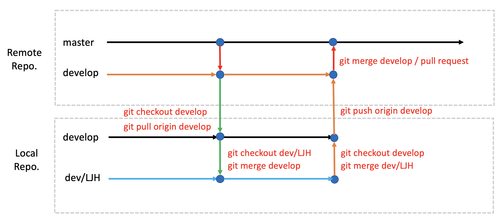

# KD17_Project

## 미니 프로젝트 팀 구성

|  프로젝트명   |   팀명   |  팀장  |          팀원          |   픒랫폼   |                                                     트렐로                                                     |
| :-----------: | :------: | :----: | :--------------------: | :--------: | :------------------------------------------------------------------------------------------------------------: |
|   UnRailed    |   미정   | 차명근 |     차명근, 김탁영     | VR, Photon | [트렐로](https://trello.com/b/5fGuIDl0/mini-projectunrailed-vr?search_id=bcff72fe-7af4-4895-b43c-0a867e8ba7ae) |
| 디펜스 RPG 활 |   미정   | 심성보 |     심성보, 배효은     |     VR     |                            [트렐로](https://trello.com/b/7kuEACU7/my-trello-board)                             |
|    무인도     | 표류자들 | 윤세원 | 윤세원, 송정현, 최성룡 | VR, Photon |                            [트랠로](https://trello.com/b/7kuEACU7/my-trello-board)                             |

### 개발 세부 일정

| 기간                |         구분         |                      작업                       |
| :------------------ | :------------------: | :---------------------------------------------: |
| 11월15일            | 기획 발표 및 팀 구성 | 팀장 선임, 트랠로, 슬랙, 깃허브 설정, 세부 기획 |
| 11월18일 ~ 11월22일 |    1차 개발 기간     |                 메인 로직 구현                  |
| 11월25일 ~ 11월28일 |    2차 개발 기간     |             디버깅, 수정/보안 작업              |
| 11월28일            |    발표문서 작성     |      [문서 탬플릿]() / [발표문서 업로드]()      |
| 11월29일            |     시연 및 발표     |                                                 |


## 미니 프로젝트

- 기획 발표: 2024.11.15 ([기획문서 업로드](https://drive.google.com/drive/folders/1r4X86MJrmzo3YP9tDqsx6CPOKeBEw2Vg?usp=share_link))
- 팀 인원 : 2인 1팀 또는 3인 1팀
- 개발 기간: 2024.11.18 ~ 2024.11.28

### 주제

- 포톤을 응용한 네트워크 게임
- VR 콘텐츠 (어트랙션 연동)

### 개발 에셋

- 메디치 구매한 유료 에셋 활용
- 타이틀 화면부터 종료 화면 반드시 구현

### 협업 및 코드 백업

- 최종 프로젝트 전 Git / GitHub의 능숙한 사용
- Git / GitHub 활용
- 브랜치 전략 사용

### 미니 프로젝트 시연 및 발표

- 발표문서 작성 : 2024.11.28
- 시연 및 발표 : 2024.11.29

---

## 유니티 프로젝트 생성 절차

### 팀장이 해야할 프로젝트 및 Git 초기 설정

1. Github에서 리포지토리 생성
     - README.md 생성은 선택 사항
     - .gitignore 생성 : Unity 탬플릿 선택

2. 유니티 프로젝트 생성
     - 적절한 프로젝트 폴더안에 유니티 프로젝트 생성

3. 터미널에서 깃 초기화
     - 프로젝트 폴더로 이동 (cd 명령)
     - 깃 초기화 (git init)

4. 리모트 리포와 연결
     - git remote add origin [원격 리포 주소]

5. 원격 리포에서 초기 데이터 다운로드
     - git pull origin master
     - .gitignore 파일이 로컬로 다운로드 됐는지 확인

6. git lfs 설정
     - git lfs install
     - curl [.gitattributes 파일 URL] > .gitattributes

7. lfs 설정 커밋 후 푸시
     - git add .gitattributes 
     - git commit -m "Git LFS 설정"
     - git push origin master

8. 유니티 초기 프로젝트 파일 커밋 후 푸시
     - git add .
     - git commit -m "Project 초기파일 추가"
     - git push origin master

9. GitHub에서 develop 브랜치 생성

#### 팀원의 프로젝트 클론

1. 리모트 리포지토리 클론
     - 터미널에서 프로젝트 경로로 이동
     - git clone --branch develop [리모트 리포지토리 URL]

2. 팀원 개인 브랜치 생성
     - git checkout -b dev/[영문이니셜_3자]

#### 팀장의 로컬 마스터 브랜치 삭제

1. 팀장의 로컬 develop 브랜치 생성
     - git checkout -b develop

2. 마스터 브랜치 삭제
     - git branch --delete master

3. 팀장 개인 브랜치 생성
     - git checkout -b dev/[영문이니셜_3자]


## 깃 브랜치 전략
### Git Flow



- 작업 시작하기 전 깃 작업

```shell
# 로컬 조장소가 develop 브랜치인지 확인
git branch

# 만약 develop 브랜치가 아닌경우 develop 브랜치로 체크아웃
git checkout develop

# 원격 저장소의 develop 브랜치에서 가져오기(Pull)
git pull origin develop

# 충돌(Conflict)가 발생한 경우 해결한 후 Merge Commit 한다.
git add .
git commit -m "충돌해결 - 내용"

# 정상적으로 pull이 완료된 후 자신의 개발 브랜치로 체크아웃
git checkout dev/LJH

# 로컬 develop 저장소의 변경사항을 자신의 개발 브랜치로 Merge 한다.
git merge develop

# 충돌(Conflict)가 발생한 경우 해결한 후 Merge Commit 한다.
git add .
git commit -m "충돌해결 - 내용"

# 정상적으로 병합이 완료된 후 작업을 진행한다.

```

- 작업 종료 후 깃 작업

```shell
# 자신의 개발 브랜치의 작업내용을 모두 커밋한다.
git add .
git commit -m "작업 내용"

# 로컬 develop 브랜치로 체크아웃한다.
git checkout develop

# 자신의 개발 브랜치의 내용을 로컬 develop 브랜치로 병합(merge) 한다.
git merge dev/LJH

# 충돌(Conflict)가 발생한 경우 해결한 후 Merge Commit 한다.
git add .
git commit -m "충돌해결 - 내용"

# 충돌을 해결하거나 정상적으로 병합이 완료된 경우 원격 develop 브랜치로 push 한다.
git push origin develop

# 만약 원격 리포지토리에 변경 사항이 있을 경우 먼저 Pull 한 후 Push 한다.
```